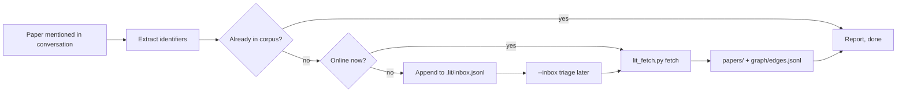

<!-- Copyright (c) 2026 JG Systems Consulting Ltd. Source: https://github.com/jgsystemsconsulting/jgs-lit-memory. See LICENSE. -->
<!-- SPDX-License-Identifier: MIT -->

# jgs-lit-memory

<p align="center">
  
  
  
  
  
</p>

**Capture the papers once: one record, the citation graph, and an analysis brief per paper. Query the corpus, not the internet, next time.**

`lit_fetch.py` captures scholarly papers from OpenAlex into a per-project
`.lit/` corpus: one normalized JSON record per paper, citation edges between
them, optional findings notes, and a low-friction inbox for offline capture.
The companion `lit-capture` skill drives the capture procedure from research
conversations, so the next session queries the local corpus instead of
re-searching the same papers. Built for people who do literature-heavy work
inside coding agents: ZCode, Claude Code, Cursor, Codex, Gemini CLI, and
Copilot.

## Why

Research conversations re-find the same papers every week. The corpus answers
"do we have it?" from one normalized record per paper under `papers/` and
"who cites whom?" from `graph/edges.jsonl`. Neither layer records claims,
methods, limits, or why a paper matters here. Paper briefs do: one analysis
sidecar per paper at `.lit/briefs/<W-id>.json`. Full pitch:
[jgsystemsconsulting.github.io/jgs-lit-memory](https://jgsystemsconsulting.github.io/jgs-lit-memory/).

## Prerequisites

- Python 3.9+ (standard library only; no pip packages)
- Network access to `api.openalex.org`; an OpenAlex API key is optional
  (singleton DOI and W-id lookups are free, budgeted calls warn without one).
  Setup: [docs/skill-usage.md](docs/skill-usage.md#the-openalex-api-key)

## Install

```bash
git clone https://github.com/jgsystemsconsulting/jgs-lit-memory
cd jgs-lit-memory
python install.py                 # ZCode, flat ~/.zcode/skills/lit-capture/
python install.py --agent claude  # Claude Code, ~/.claude/skills/jgs/lit-capture/
python install.py --agent all     # every user-global host
python install.py --dry-run
python install.py --list-agents
```

Wrappers: `install.sh`, `install.ps1`. The installer copies the whole skill
folder, so `SKILL.md` and `lit_fetch.py` land together; edits happen in this
repo and get re-installed. An existing flat mirror (for example
`~/.claude/skills/lit-capture/`) keeps working as the documented fallback.
Per-host paths: [docs/other-agents.md](docs/other-agents.md). Restart the
agent session after installing.

### Install with your AI agent

Copy the prompt below into your coding agent (ZCode, Claude Code, Cursor, or
similar). It reads this README and installs the pack autonomously.

```text
Install jgs-lit-memory v1.2.0 (agent skill pack). Read the README and follow it. Do not invent steps.

Repository: https://github.com/jgsystemsconsulting/jgs-lit-memory

Do this in order.

- Read README.md and docs/skill-usage.md. If the host is not ZCode, also read docs/other-agents.md.
- Prerequisites: Python 3.9+ (stdlib only; no pip packages). Network access to api.openalex.org. An OpenAlex API key is optional.
- Detect the agent host and install:
    python install.py --dry-run
    python install.py                  # ZCode → ~/.zcode/skills/lit-capture/
    python install.py --agent claude   # Claude Code → ~/.claude/skills/jgs/lit-capture/
  Use --agent all only if the user wants every supported host. Wrappers: install.sh, install.ps1.
- Verify: the installed folder contains SKILL.md and lit_fetch.py (1 skill, matches SKILLS.md).
- After capture, the skill drains the brief queue with --enrich-pending and writes briefs through the script (--brief-write); see docs/skill-usage.md.
- Note the MIT licence in LICENSE.

Finish by telling the user to fully restart the agent session so it
rediscovers skills, and show the first-run examples from
docs/skill-usage.md ("Capture this one: 10.1038/nature12373").

If a step fails (Python missing, wrong skill count, install path refused),
stop and report the exact failure and the README section that applies.
```

## Usage

The `lit-capture` skill is conversational. It triggers when a paper with a
DOI, arXiv id, OpenAlex W-id, or exact title comes up and looks worth
keeping, or when you ask to capture, save, or file a paper:

```text
Capture this one: 10.1038/nature12373
Save that arXiv paper, 2401.12345, "Attention Is All You Need"
What do we have on citation graph bias? Check the corpus first.
```

The flow, start to finish:



Direct script use, one resolution verb per invocation:

| Invocation | Behavior |
|---|---|
| `--doi <doi>` | Singleton capture by DOI (free). seed=true, source="capture". |
| `--openalex <W-id>` | Singleton capture by W-id (free). Same write semantics. |
| `--arxiv <id> --title <t>` | No arXiv lookup exists in OpenAlex; resolves through the verified title search. Bare `--arxiv` is a usage error. |
| `--title <t> [--author <surname>] [--year <yyyy>]` | Budgeted search with client-side verification. Near-misses print as candidates and write nothing. |
| `--ids "W1\|W2\|..."` | Batch fetch, 100 per call, skips existing records. seed=false, source="fetch"; `--seed` overrides. |
| `--inbox` | Triage `.lit/inbox.jsonl`: dedupe, resolve, rewrite the queue once. Failures stay queued with their reason. |
| `--status` | Corpus summary. Read-only. |
| `--check` | Live smoke test of the four endpoint forms. |
| `--enrich-pending` | List briefs awaiting enrichment: `pending` and `partial` as JSONL rows; unreadable files are labeled `invalid`. Read-only. |
| `--brief-status [W-id]` | Brief counts by status and basis; with an id, print that brief's JSON. Read-only. |
| `--brief-check [W-id]` | Validate one brief or all (schema, claim graph, derived fields). Exit 1 when invalid. |
| `--brief-write --id <W-id> --file <payload.json> [--human]` | Validate and atomically write a brief. Replaces the `agent` block, keeps `human` unless `--human`, derives `status` and `basis`. |
| `--brief-restub --id <W-id>` | Reset the brief's agent shell and enrich stamps to pending. Keeps `human`. |

Common flags: `--dir <path>` (default `.lit`), `--api-key <key>` (default env
`OPENALEX_API_KEY`), `--seed`, `--author`, `--year`. Exit codes: 0 success or
already present, 1 any failure, 2 usage error.

Full invoke and first-run detail: [docs/skill-usage.md](docs/skill-usage.md).
Skill index: [SKILLS.md](SKILLS.md).

## Corpus layout

`.lit/` lives in the project that produced it and is git-tracked there:

```
.lit/
  papers/<W-id>.json      one normalized record per paper
  briefs/<W-id>.json      analysis sidecar per paper (agent-authored, script-validated)
  graph/edges.jsonl       {"source": citing W-id, "target": cited W-id}, one per line
  graph/aliases.json      {"alias W-id": "canonical W-id"} recorded on 301 merges
  findings/<YYYY>-<slug>.md  optional human notes
  inbox.jsonl             offline capture queue
  SKILL.md                generated corpus contract; never hand-edited
```

All writes are atomic (temp file plus `os.replace`). A crash mid-batch
leaves completed records on disk and never a half-written file. Edges are a
full-rewrite idempotent union, so the next successful run heals partial runs.

## Limits

- Abstracts come only from `abstract_inverted_index`, are null on roughly 40
  to 55 percent of works, and keep their trailing junk verbatim. The corpus
  is for identity, graph, and retrieval, not full text.
- `referenced_works` is lossy relative to printed reference lists; the graph
  is biased toward DOI-matchable citations.
- OpenAlex metadata is CC0. Reconstructed abstracts are for local corpus use.
- Without an API key, budgeted calls (batches, title searches, inbox triage
  with search entries) draw on a small keyless daily budget and the script
  warns first. Singleton DOI and W-id lookups are free.

## Use with other agents

`install.py` targets ZCode (default, flat), Claude Code, OpenClaw, GitHub
Copilot CLI, and OpenAI Codex CLI natively, Gemini CLI as an extension, and
Cursor as project-local rules. `--agent all` covers the user-global hosts.
Paths and transform notes: [docs/other-agents.md](docs/other-agents.md).

## Testing

```bash
python test_lit_fetch.py                    # offline checks; network is faked
python skills/lit-capture/lit_fetch.py --check  # live smoke test of endpoint forms
python scripts/check_release.py             # release gate
```

Set `OPENALEX_API_KEY` for the full daily budget. Where to get one and how
to set it: [docs/skill-usage.md](docs/skill-usage.md#the-openalex-api-key).

## Licence

MIT. Copyright (c) 2026 JG Systems Consulting Ltd. See [LICENSE](LICENSE).
Fork, adapt, and redistribute under the same terms. See
[CONTRIBUTING.md](CONTRIBUTING.md).

To request a commercial or academic licence for JGSC Labs products, or if
you are unsure which licence you need, see
[labs.jgsystemsconsulting.com/licensing.html](https://labs.jgsystemsconsulting.com/licensing.html).

## Support

Bugs: open a GitHub issue using the bug-report form. Improvements: the
improvement form. Questions: [Discussions](https://github.com/jgsystemsconsulting/jgs-lit-memory/discussions).
Security: see [SECURITY.md](SECURITY.md) (private advisory; do not open a
public issue). Product and support email: support@jgsystemsconsulting.com.

Version: 1.2.0. History: [CHANGELOG.md](CHANGELOG.md).
